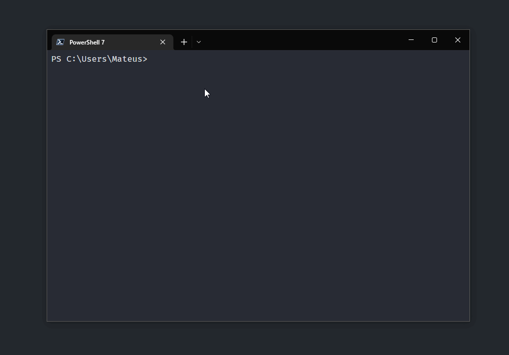

# `tubesearch-cli`

Quickly search for YouTube videos from your Terminal CLI

> This script only works with **Windows** at the moment. There are plans to support other platforms!



## Usage

```bash
tubesearch-cli <your-search-query>

# example: tubesearch-cli how to use next 13
```
